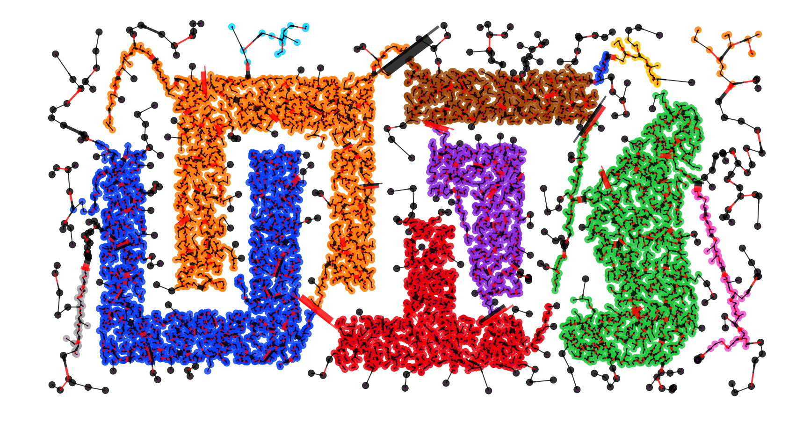

.. image:: https://img.shields.io/pypi/v/druhg.svg
    :target: https://pypi.python.org/pypi/druhg/
    :alt: PyPI Version
.. image:: https://img.shields.io/pypi/l/druhg.svg
    :target: https://github.com/artamono/druhg/blob/master/LICENSE
    :alt: License

=====
DRUHG
=====

| DRUHG - Dialectical Ranking Universal Hierarchical Grouping (друг).
| Performs clustering based on subjective rankings of each datapoint and builds minimum spanning tree.
| **Does not require parameters.**
| To compensate the inevitability of the result, user can set the limits on the size of the cluster with ``limit1`` and ``limit2``.
| To get genuine result and genuine outliers set ``limit1`` to 1.
| Parameter ``fix_outliers`` allows to label outliers to their closest clusters via mstree edge.

-------------
Basic Concept
-------------

| There are some optional tuning parameters but actual algorithm requires none and is universal.
| It works by applying **the universal society rule: treat others how you want to be treated**.
| The core of the algorithm is to rank subject's closest subjective similarities and unite subjects into commonalities accordingly.
| Parameter ``max_ranking`` controls precision vs productivity balance, after some value the precision and the result would not change.
|
| Let's say you have a list of friends and your number one friend is John, but you are number 5 on his friend list, then you would treat him as your number 5 friend.
| todo: insert picture
| Process of merging subjects and commonalities goes until the whole tree is a commonality.
| Commonalities that were merged against sizeable commonalities become clusters.
| Subjects in order to be merged have to be mutually close to each other and have to have the closest relationship among everyone else.
| They have to reflect from all others and each other, and then because of that become one.
| The reflections of the subjects are it's key, only by reflecting in the other, the subject unveils it's potential energy.
| *Cluster is the mutually-close reflections.*
| Read more in the paper(be aware, it is a translation) https://github.com/artamono/druhg/papers

----------------
How to use DRUHG
----------------
.. code:: python

             import sklearn.datasets as datasets
             import druhg

             iris = datasets.load_iris()
             XX = iris['data']

             clusterer = druhg.DRUHG(max_ranking=50)
             labels = clusterer.fit(XX).labels_

It will build the tree and label the points. Now you can manipulate clusters by relabeling.

.. code:: python

             labels = dr.relabel(limit1=1, limit2=len(XX)/2, fix_outliers=1)
             ari = adjusted_rand_score(iris['target'], labels)
             print ('iris ari', ari)

It will relabel the clusters, by restricting their size.

.. code:: python

            from druhg import DRUHG
            import matplotlib.pyplot as plt
            import pandas as pd, numpy as np

            XX = pd.read_csv('chameleon.csv', sep='\t', header=None)
            XX = np.array(XX)
            clusterer = DRUHG(max_ranking=200)
            clusterer.fit(XX)

            plt.figure(figsize=(30,16))
            clusterer.minimum_spanning_tree_.plot(node_size=200)

It will draw mstree with druhg-edges.

-----------
Performance
-----------
| It can be slow on a highly structural data.
| There is a parameters ``max_ranking`` that can be used decreased for a better performance.

----------
Installing
----------

PyPI install, presuming you have an up to date pip:

.. code:: bash

    pip install druhg

-----------------
Running the Tests
-----------------

The package tests can be run after installation using the command:

.. code:: bash

    nosetests -s druhg

or, if ``nose`` is installed but ``nosetests`` is not in your ``PATH`` variable:

.. code:: bash

    python -m nose -s druhg

The tests may fail :-D

--------------
Python Version
--------------

The druhg library supports both Python 2 and Python 3. 

------------
Contributing
------------

We welcome contributions in any form! Assistance with documentation, particularly expanding tutorials,
is always welcome. To contribute please `fork the project <https://github.com/artamono/druhg/issues#fork-destination-box>`_ 
make your changes and submit a pull request. We will do our best to work through any issues with
you and get your code merged into the main branch.

---------
Licensing
---------

The druhg package is 3-clause BSD licensed.
