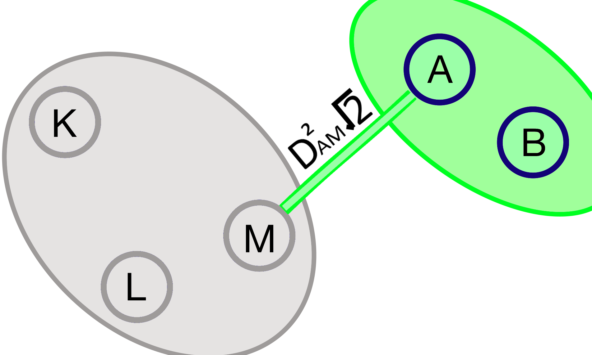

.. |ss| raw:: html

   <strike>

.. |se| raw:: html

   </strike>

.. raw:: html

   

.. role:: underlined
   :class: underlined

.. role:: bolditalic
   :class: bolditalic

.. role:: raw-math(raw)
   :format: latex html

#########################################
Диалектика данных или сказка для взрослых
#########################################

.. image:: ./pics/first/Upsides.png  
   :alt: Marx upsides Hegel

.. |zh| image:: ./pics/first/zh.png
   :alt: Letter zh
   :height: 70px
   :width: 50 px

|zh| или-были данные. Многие пытались их посчитать, но не многим это удавалось. Каждый раз это происходило против их воли, их нормировали, прореживали и подвергали другими гнусными занятиями. Конечно же, они чувствовали это, но были не в силах этому помешать. А как же им хотелось посчитать себя самим. Один раз и навсегда. И жить долго и счастливо в детерминированном единстве своего существа.  

| Учёный! Останови насилие над данными!  
| Дай возможность им самим раскрыть себя. Воспользуйся диалектическим алгоритмом кластеризации ДРУГ.  
| Нажми одну кнопку! Восхитись первичностью Материи!

    .. code:: python

        from druhg import DRUHG  

        dr = DRUHG()  
        dr.fit(your_dataset)  
        dr.minimum_spanning_tree_.plot()  
        dr.labels_ # -1 are outliers
        # enjoy

| 150 лет назад Карл Маркс взял единичку Капитализма — товар и с помощью диалектики Гегеля раскрутил его внутренние противоречия.  
| Товар имеет *качественную* и *количественную* стороны, то есть потребительную полезность и цену. Находясь в единстве, цена и полезность борются с друг другом, и эта борьба развивается в отношениях производитель, покупатель, продавец, потребитель.  
| Из этого выводится отчуждение труда и не заинтересованность производителя в конечном потреблении, а в итоге приводит к отчуждению человека человеком, так как всё становится товаром.  
| Эти и другие вытекающие из товарности |ss| фичи |se| баги вы и так ежедневно наблюдаете вокруг себя.  
| Оставим коммодификацию в покое.  
| Нас в первую очередь интересует диалектический метод. Почему бы не применить его к данным? Не заставить их говорить за себя?  
| Взять единичку данных, выделить *качественную* и *количественный* стороны, синтезировать *меру*, получить новую сущность и за счёт этого перейти от *единичного* к *всеобщему*, *особенному*, к кластеру?  
| Что если дать данным посчитать самим себя?  

.. image:: ./pics/first/kozlenok.png
   :alt: Kozlenok
   :height: 200px

**********************************************************
DRUHG — Диалектический Ранговый Универсальный Группировщик
**********************************************************

| Отдельные слова выделенные курсивом являются философскими категориями.
| *Количество* — интенсивное многое, рассмотренное как одно. Определённость безразличная к изменениям. Внешняя сторона отношений.
|
| Чёткую терминологию знать не обязательно, хотя бы потому что её нет. Но стоит напрячься при виде курсива, так, на всяких случай.  
| Приступим.

   .. image:: ./pics/first/Base.png
      :width: 200px
      :align: center

   | Cубъекты: K, L, M, A, B. Между ними существуют отношения.
   | Субъекты независимы в своём восприятии, на то они и субъекты.  

Субъект
#######

| Субъекты есть. Они независимы в своей субъективности. Каждый субъект самостоятельно рассматривает свои отношения к другим субъектам. Эти отношения качественно измеряются и количественно ранжируются-нумеруются каждым субъектом в отдельности.  
| Эти отношения обладают двумя противоречивыми свойствами *качеством* и *количеством*, расстоянием и рангом.  
| (равноудалённые субъекты имеют одинаковые ранги)

   .. figure:: ./pics/first/Closest.png
      :alt: Closest
      :width: 200px  

      Ближайшие отношения каждого субъекта.

      Отметим:
      * Взаимные отношения у LM и у АB
      * Одностороннее отношение от K к L
      * Нет связи между двумя группами

| Из большого множества всевозможных отношений есть одно *особенное* — наиближайшее.  
| У каждого субъекта наиближайшее своё.
| Иногда отношения взаимны, а иногда нет.
|
| Что происходит между K и L?
| **Если K будет считать** ближних к себе, то получится так.
| 1. K первый
| 2. **L второй**
| 3. М третий и тд

.. figure:: ./pics/first/Count.png
   :alt: Count_K
   :width: 200px
   
   Субъект K считает от себя.

| **Если же L начнёт считать** от себя, то:
| 1. L первый
| 2. M второй
| 3. **K третий** и тд

   Субъект L считает от себя.

| Расстояния KL друг для друга совпадают, а ранги нет.
| Ближайшие различаются!
| Для K L второй, для L K третий.

.. |CountLK| figure:: ./pics/first/Count_3.png
   :alt: Count_3
   :width: 200px

   Расстояние то же, но наиближайшие и ранги различаются.

| Ближайшие отношения могут быть взаимными (как у LM, AB), тогда ранги и расстояния совпадут и противоречий не будет.
| Или не взаимными, как у KL, для K K→L *особенное*, а для L L→K не особенное, безразличное. **Выходит, что одно и то же отношение и особенное и не особенное, ближайшее и нет, одновременно.** Это противоречие и его нужно *снять* (позитивно разрешить).  
|
| Посмотрим на эти отношения с двух сторон, с качественной и количественной:
| *Количества*-ранги различаются: рангLK :math:`\neq` рангKL.  
| *Качества*-расстояния на первый взгляд равны. Но только на первый взгляд. Категория *качество* означает внутренние свойства объекта. *Качества* не доступны для внешнего наблюдателя. Передать *качество* невозможно.
| Субъект K не знает, как к нему относится L, он может только посчитать какой он в нумерации L.
| Чтобы получить чужое качество, нужно взять своё качество чужого количества.
| Тогда для обоих участников качества будут равны с их точки зрения и противоречие будет устранено. 
|
| Субъект K будет относится к L так же, как к M. Так как по его мнению, к нему так относится L!
| Теперь для субъекта K расстояние до L и M одинаково особенное, отношение к субъекту растворилось, породив отношение с нечто иным.
|

.. figure:: ./pics/first/Increased.png
   :alt: Increase
   :width: 200px

   Расстояние от K к L увеличилось, до третьего ранга.  
   ("удлиннилось" от тонкой белой стрелки до толстой :underlined:`прозрачной` синей) 

   :raw-math:`$$ D_{KL} = d_{KM} = d_{3} \neq d_{KL} $$`

| Для каждого субъекта мы можем найти наиближайшее отношение, посчитать качественную и количественную стороны. И тогда возникают сущности следующего уровня - общности.
| Их нельзя просто так брать, они должны органически родиться/вывестись из субъектов. 
| Для этого нам понадобится диалектика! 
| Пристегните ремни, ожидается нагрузка мозга ;-)

*Диалектика*
############

| Смысл чего-то лежит не только внутри, но и вне, во всём окружающем. Именно так это что-то есть и различимо.
| Стул является стулом, потому что он *не* стол, *не* жена, *не* вселенная, *не* всё, всё, всё.
| Частичка "не" есть отрицание, через неё получается внешняя половина смысла.
|
| Отрицать можно по разному. Отрицая формально логически, "не стул" превращается в абсолютную бесконечность всего и вся, за исключением одного стула.
| Бесконечность без единички, останется той же бесконечностью.
| Не только "не стул" равен Мировой бесконечности, но и "не жена" равна ей, как и любое другое "не" что-то.
| Полученную Мировую бесконечность Гегель называл *Абсолютной идеей/духом*.
| Отрицая её он получал ничто, отрицая ничто получал бытие, и развёртывал из них свою систему.

   (Карта Науки логики Гегеля)
   Как же так? Почему отрицая каждый раз не получается Абсолютных дух?
   Почему из *ничто* получилось *бытие*?

| Некать нужно по маленькому, с помощью отрицания переходить в *своё иное*, а не Мировую бесконечность.   
| Нужно такое отрицание, которое не выкинет нас на уровень Вселенной, а останется на своём локальном уровне.
|
| Жена это тот у кого есть муж. Смысл жены вне её, в муже.
| Отрицая жену получим мужа. Отрицая мужа получим жену. 
| "Не жена" -> муж; "не муж" -> жена; М->Ж; Ж->М; М->Ж; и так до бесконечности.
| Такое бесконечное отрицание Гегель прозвал дурным. Такое "не" бесплодно.
|
| Взаимные отрицания приводящие к друг другу не дают развития, держат на своём уровне.
| В то же время, они не разрывны и находятся в единстве.
| Поэтому и отрицать их нужно вместе. Вместе с уровнем, с контекстом.
| К этой парочку нужно добавить "мостик" объединяющий на их уровне и выводящий на следующий.
| Отрицая такую триаду мы выйдем на следующий уровень. Такое отрицание называется *снятием*.
|
| Муж с женой отрицаются через брак и *снимаются* в семью.
| Конечно же, это были не муж с женой, а мужчина с женщиной.
| Наш язык давно приспособился передавать диалектику хитросплетения противоречий и уровней единичными словами.
| С одной стороны, это делает жизнь проще, а с другой — мешает разобраться в причинах и следствиях.
|
| Вернёмся к нашим *количеству* и *качеству*. Отрицая количество, получаем качество и наоборот. У нас получилась замкнутая отрицанием бесконечность.
| *Количество-качество* являются взаимными иными, это противоречия находящиеся в единстве. Это внешняя и внутренняя стороны отношений субъекта, они находятся на одном уровне.
| Осталось добавить "мостик" из уровня субъекта в уровень общности.
| Таким образом произойдёт переход от старого в новое, произойдёт *развитие*.

Объективная относительность.  r · D² · √M/m
###########################################

| Прежде чем применить законы диалектики и выразить отношения в оптимизационной функции.
| Стоит отдельно сказать о субъекте. Почему субъекты, если мы говорим о данных?
| Мы рассматривали отношения записей данных к другим записям, как будто у них есть сознание и свобода воли.
| На самом деле, мы могли бы рассматривать частички материи: увеличивать радиус для того, чтобы в кружочек попало такое же количество точек. То есть выравнивать плотность, не определяя её.

   .. figure:: ./pics/first/QuantityNotEqual.png
      :alt: QuantityNotEqual
      :width: 150px

      *В зелёной окружности 3 объекта, в противоположной 4. Как увеличить зелёную окружность, чтобы выровнять количество объектов?*

| Есть воля или нет, нам не важно, данный подход можно использовать к любым типам материи: записям данных, людям в обществе, частицам вещества и тд.
| Субъективные индивидуальные взгляды выстроят объективную детерминированную картину. 
| 
| Вспомним нашего субъекта K, он был независим, но тем не менее, он видел более близких LM. Для того чтобы выравнять свои отношения, субъектам необходимо "ждать" чужих.

   .. figure:: ./pics/first/QualityReciprocated.png
      :alt: QualityReciprocated
      :width: 150px

      *Подсчёт выражения из А в М. В окружностях должно быть по 4 объекта, это увеличит расстояние до :math:`$ D_{AL} $`. В одной окружности 2 своих, а в чужой 3. Мера :raw-math:`$ \sqrt{\frac{2}{3}} $`.*

| Построим математическое выражение, упорядочивающее все отношения. Чтобы одни ждали других.
| Будем обозначать |ss| свои |se| субъектные величины заглавными латинскими, а иные строчными.  
| Тогда диалектическое отношение равно :math:`$ r · D^2_r · \sqrt{\frac{M_R}{m_r}} $`.
| * *Количество*: чем меньше ранг, тем первичней отношение.  
| :math:`$ r $` — чужой ранг (:ath:`$ r >= R $`), 
| * *Качество*: чем ближе, тем первичней.
| :math:`$ D_r $` — своё расстояние чужого ранга (:math:`$ D_r >= D_R = d_r $`), 
| * *Мостик-Мера*: чем выше принадлежность, тем первичней 
| :math:`$ \frac{M_R}{m_r} $` — принадлежность в моменте, M количество своих членов в рамках R, m количество членов другого в рамках r (одиночки стремятся к большинствам). 
| Мера это уже почти новая сущность. Субъект уже ощущает себя общностью. Действует за неё и для неё. (см. Приложение)
|
| *Качество-количество-мера* (расстояние-ранг-принадлежность) гегелевская триада соединяется не просто через произведение, а через степень, чтобы качественно оторвать величины друг от друга. Подобным образом площадь и длина оторваны друг от друга.  
| (По сути, степенная зависимость помогает разбивать ничьи)
|
| Взяв самое |ss| минимальное |se| особенное субъективное отношение одного, увидим, что оно удовлетворит вообще все субъекты и общности, и станет объективным всех. Взяв следующее субъективное, опять получим объективное. И так пока не соединим всех воедино.
| 
| Субъективные *единичные* приводят нас к единому *всеобщему*.

   .. figure:: ./pics/first/MST.png
      :alt: MST
      :width: 200px

      Все субъекты соединены в единую сеть. Построено Минимальное Остовное Дерево.
|
| # TODO: видео как всё сливается в единое. Может не через точки, а через площади?  

Особенная общность — кластер
############################

| Самодвижение субъектов образует общности, которые вскоре исчезают в других общностях.  
| Каждый шаг этого самодвижения — это исчезновение двух и появление новой общности.  
| В самом конце будет всего лишь одна общность — подлинный субъект, мир в его целом.  
|
| Каждым шагом части становятся целым. А став целым превращаются в часть следующего витка цикла.  
| Стать целым, чтобы быть всего лишь частью? — это противоречие между *единичным* и *всеобщим* снимает *особенное*.  
| Став целым, общность становится всеобщим для себя — такие общности мы привыкли называть **кластер**. (*бытие-для-себя*)  
|

   .. figure:: ./pics/first/Sandpiles.png
      :alt: Sandpiles
      :height: 200px

      Если взять крупинку песка и добавить к ней другую крупинку, мы получим две крупинки, вне зависимости от расстояния между ними.

      Если взять кучу песка и навалить рядом другую кучу песка, то получится либо одна большая куча, либо две, в зависимости от их взаимной близости.

      Станет ли результатом слияния новая сущность, будет зависеть от размеров и близости.

      *(Интересное замечание: мы, как наблюдатели, выступаем в этих примерах кластером :-) )*

| Продолжим диалектически раскручивать отношения уже между общностями, в которых растворились субъекты. Субъектов как бы не стало, мы вышли на следующий уровень отношений и сущностей.
|

Граница и предел. K · D² · √min(N, N')
######################################

| Общности это всего лишь стороны предстоящего слияния. Ещё чуть-чуть и они исчезнут став единой стороной следующего противостояния.
| Между сторонами пролегает граница одновременно соединяющая и разделяющая их.
| Кластеры "знают" о себе по одну сторону границы, но не знают о кластерах по другую сторону.
| Если граница значима, то субъекты становятся новым кластером.
|  **Они за той границей сильно не такие, как мы. Мы разные, но сильно не такие как они. Значит мы равны и едины.**
| 
| Кластеры имеют различия выраженные в пределах. Сложив свои пределы, они сравнивают их с новым пределом границы. 
| Если предел преодолён всеми и каждым, то происходит скачок. Старые границы кластеров стираются, старые различия пропадают. Остаются только субъекты. Каждый из которых берёт себе новый предел.

.. |LeftAma| image:: ./pics/first/LeftAmal.png
   :alt: LeftAmal
   :width: 200px

|     |LeftAma| |RightAma|
|      Стороны не могут считать чужие кластеры. Граница суммируется по количеству своих кластеров. Чем больше кластеров в общности, тем проще ей стать кластером.

| Общность-сторона будет пробовать перейти свои внутренние границы.
| Ранее мы считали субъектов, чтобы получить ранг. Находясь на уровне кластеров, мы будем считать их.
| Будем получать новый кластер за счёт обнуления старых.
| Кластеров в своей общности — :math:`K`. В каждом кластере :math:`N_{i}` субъектов.  
| У каждого субъекта предел своего кластера — :math:`D^2_{i}`.
| Сложив все внутренние пределы, получим общее выражение для общности :math:`\sum_{K} N_{i} · D^2_{i}`.
| Напротив будет внешнее выражение границы, состоящее из диалектического расстояния :math:`D^2_{r}`, количества кластеров и мостика.
| Качественная сторона границы это отношение субъекта, диалектическое расстояние из предыдущей фазы. Качество может быть получено только через "восприятие" субъекта. 
| Мостик переводит из уровня отношения общностей/частей на уровень Всеобщего/целого. Для общностей происходит соединение, но со стороны целого происходит прирост меньшего к большему. То есть мостик, это прирост субъектов :math:`min(N, N')`. Чем больше обе из сторон, тем проще будет перейти через границу.
| Выражение общей границы для каждой группы кластеров :math:`K · D^2_r · \sqrt{min(N, N')}`.
|
| Общность станет кластером, если её внутренние различия :math:`\sum_{K} N_{i} · D^2_{i}` будут преодолены :math:`K · D^2_r · sqrt{min(N, N')}`.
| Если предел не преодолен, то внутренние противоречия будут накапливаться, следующая граница будет иметь большее число кластеров, большее расстояние и возможно больший мостик.
| В определённый момент количество перейдёт в качество, предел будет преодолён, все внутренние различия сотрутся, все субъекты возьмут новое качество. Родится новый кластер с суммарным пределом равным :math:`N · D^2_r`.
| Эти внутренности будут больше старых и из-за этого следующую границу будет не просто перейти. 
| По сути, следующее расстояние :math:`D^2_{new}` должно будет победить количество всех субъектов :math:`N · D^2_{old} `!
| 
| Если наблюдать весь процесс роста отношений, то в самом начале у субъектов нет предела, так как нет иного для соотношения. Если не будет иного, то не будет движения.
| Найдя ближайшие отношения субъекты начнут приращивать свои кластеры, объединяясь во всё большие группы, пока не останутся две стороны-общности, которые никогда не станут единым кластером.
| Последняя общность есть всеобщее, оно не может стать кластером, так как у неё нет иного, чтобы в нём отразиться. Нет границы, чтобы её перейти.

Результат
#########

| Обычный алгоритм кластеризации требует ввода параметров от которых будет зависеть конечная группировка. Ошибся и получил неправильное решение. 
| ДРУГ застрахован от ошибки, так как из параметров у него только метрика - то есть то, как измерять расстояние между субъектами (по умолчанию Евклидова метрика).
| ДРУГ кластеризует лучше стандартных алгоритмов, предоставляя пользователю "природную" группировку.
| Сравнение алгоритмов смотрите в приложении.
| 
| На выходе получаем **детерминированный** результат, в виде: дерева-графа, весов рёбер, вложенных кластеров, и размеченных данных.  
| Все субъекты соединёны в единую сеть-граф, так называемое минимальное остовное дерево, где веса есть диалектические расстояния.  
| Каждый субъект принадлежит кластеру.
| Кластеры образуют вложенную структуру.
| Результатом можно манипулировать, бить кластера или приклеивать выбросы, но это скорее о реализации. 
| 
| Формулы использованные в ДРУГе несколько раз менялись, что приводило к незначительному изменению результата. 
| Что говорит о том, что работа ещё не закончена. И только практика сможет поставить окончательную точку истины.
| Ваша практика. Ваша практика работы с данными.
| Поэтому если вы нашли ошибку или видите как можно улучшить алгоритм, то непременно присоединяйтесь к проекту. 

**************
  Заключение
**************

   .. figure:: ./pics/first/End.png
      :alt: End
      :height: 250px

      Вот и сказочке конец, а кто слушал молодец!

| В этой статье вы познакомились с применением диалектики в программировании и математике.
| Развитие противоречий позволило перейти от сущности субъекта к сущности более высокого уровня.
| Этот переход не был привнесён из вне, его породили сами данные.  
| *Материя* сама раскрыла себя, а не учёный привнёс идею из головы.
| Основной вопрос философии в очередной раз закрыт — *материя первична*!
|
| Диалектика Гегеля из "Науки Логики" была перевёрнута с головы на ноги. 
| Вместо стремления к *Мировому духу/идеи*, мы двигались к соседу, такому же бытию-субъекту.
| Таким образом **идея**\ листическая диалектика, превратилась в **материя**\ листическую, в диамат.
| 
| Некоторые люди спрашивают меня, а почему не показать просто формулы? Зачем весь этот текст?
| Отвечаю.
| Мне важно понять причины, докопаться до сути. Понять откуда всё берётся.
| Максима "заткнись и считай" превращает человека в бездумный калькулятор, что в конечном итоге выливается в застой в науке.
| Чем лучше вы понимаете внутренности машины, тем лучше вы будете ею пользоваться.
| Чтобы разбираться в причино-следственных связях, нужно разбираться во внутренних противоречиях объекта, что и как им движет?
| Для этого вам необходим диамат, если вы хотите самостоятельно продолжить ваше знакомство с диалектикой, то начинайте со статей классиков. Они объясняют на пальцах.
| |StalinMao| *"О диалектическом историческом материализме"* Сталина и *"Относительно противоречия"* Мао.
|
| Не пренебрегайте самой главной гегелевской триадой: Лайк-Подписка-Колокольчик. Пользуйтесь сами, делитесь с друзьями.
| Да пребудет с вами знания, в них сила!
|
| г. Новосибирск, 2017-2021.
| 
| Телеграм: https://t.me/druhg_rus  
| Telegram: https://t.me/druhg_eng  
| 
| P.S. Обращение к нетоварищам: для лучшей подачи часть материала была вульгаризирована. Вместо меновой стоимости - цена. Значит так было надо. 
| Добро пожаловать в комменты.

.. |StalinMao| image:: ./pics/first/SM.png
   :alt: StalinMao
   :width: 30px

***********
Приложения:
***********

*Мера*
######

| Гегель поэтапно рассматривал два противоречия и обосновывал третий член. Из троицы рождалась новая сущность. Он находил для неё противоречие, и обосновывал третий член. Таким образом он прошёлся по всем филосовским категориям, включив их в одну стройную систему.
| При этом он не категоризовал свою систему. Он не использовал терминов мостик и уровень.
| 
| Одной из первых троиц его системы были Качество-Количество-Мера. Именно эта троица помогла нам перейти от субъектов к общности и кластерам. 
| Вот что пишет Гегель на 60ти страницах Науки Логики, том 1, раздел 3, Мера. Выжимка из текста:  
| *В мере соединены абстрактно выраженные качество и количество. Но такое количество, что оно имеет определённость не в себе самом, а в ином. Мера это соотносящаяся с самой собой внешность. Некая рефлексия в себя.*  
| 
| Таким образом мера это уже почти новая сущность. В нашем случае, субъект уже ощущает себя общностью. Действует за неё и для неё.

Реализация на питоне
####################

| ДРУГ - это идеальный алгоритм для первоначального исследования данных (EDA).
| Находит основные кластера сопоставимые по размерам.
| Находит выбросы, в том числе глобальные.
| Очень прост в использовании:

    .. code:: python

        from druhg import DRUHG  

        dr = DRUHG()  
        dr.fit(your_dataset)  
        dr.minimum_spanning_tree_.plot()  
        dr.labels_ # -1 are outliers
        # enjoy

| Код в открытом доступе. https://github.com/artamono/druhg  
| Самая трудоёмкая часть вычислений происходит при нахождении рёбер остовного дерева.  
| Имеется параметр - ограничитель на количество соседей `max_ranking`, который почти не влияет на точность, но повышает производительность.
| Параметр `algorithm='slow'` врубит почти полный перебор, тру детерминизм(чуточку медленней).  
| На выходе получается массив меток `.labels_` с номерами кластеров.
|
| Полученные кластера можно разбивать не перезапуская алгоритм с помощью функции `.relabel()`. 
| Передавая параметры:
| `exclude` принимает список с номерами кластеров для разбивки на подкластеры.
| `limit2` запрещает формирование кластеров большего размера.  
| Выбросы это кластера размера 1, помечены `-1`.  
| `limit1` причисляет кластеры меньшего размера к выбросам.
| `fix_outliers` причисляет выбросы к ближайшим кластерам.
| 
| Примеры использования здесь https://github.com/artamono/druhg/blob/master/druhg/tests/test_druhg.py
| 
| В примерах вы найдёте применение ДРУГа к различным датасетам. 
| Среди них есть уникальные, например, последовательность точек ............... у них выделяется тело и две крайние точки-выбросы.

.. figure:: ./pics/first/example_square.png
   :alt: Square
   :height: 150px

   У квадрата выделяются тело, рёбра, вершины. То же самое происходит с кубом в трёхмерном пространстве.

   
   Хамелеон 

.. figure:: ./pics/first/example_comparison.png
   :alt: examples
   :width: 200px

   Стандартные тесты. ДРУГ в последней колонке. 

   | * Быстро и качественно.
   | * Наличие выбросов. ДРУГ - удобный способ  нахождения выбросов. Приклеить их можно с помощью параметра `fix_outliers=1`.  
   | * (Правый нижний угол) один большой кластер-датасет невозможен. Чтобы стать кластером, должно быть иное.

   
Общность
########

   *Филосовские размышления, которые были выкинуты из общего повествования. Содержат интересные замечания по поводу безразличного отношения к группе.*

| Общность есть, так как у K есть с ней отношения. Если бы отношение K→L обладало взаимностью, то общность не обнаружили бы. 
| Взаимные отношения LM породили общность, которую обнаружил иной K.
| Общность порождается более близкими отношениями и видима для иного.

.. figure:: ./pics/first/Mutaclose.png
   :alt: Mutaclose
   :width: 200px  

   Восприятие K размылось и стало безразличным. Особенное растворилось. L и М(оранжевые) стали одинаково близки.  

| Взаимно близкие отношения соединим в общности. 
| После чего присоединим все отношения субъект→общность. 
| И тогда не останется ни одного свободного субъекта, все будут являться членами той или иной общности.  

   Отношение между общностями.

| Отношения между общностями существуют, так как существуют отношения между субъектами этих общностей.
| Среди них есть *особенные*, особенные для общностей, но не для субъектов. Но в то же время **отношения между общностями возможны только через призму субъектов**.  
| Субъекты вступают в общности из-за особенности, они являются действующими лицами, хоть и соотносят общности. И поэтому для субъекта важно, к какой общности принадлежит он, и к какой будет принадлежать. Для субъекта важно, чья общность больше, то есть важна :bolditalic:`мера` **принадлежности** в пределах ранга.  
| Сколько субъектов принадлежат к его общности, а сколько к иной?
