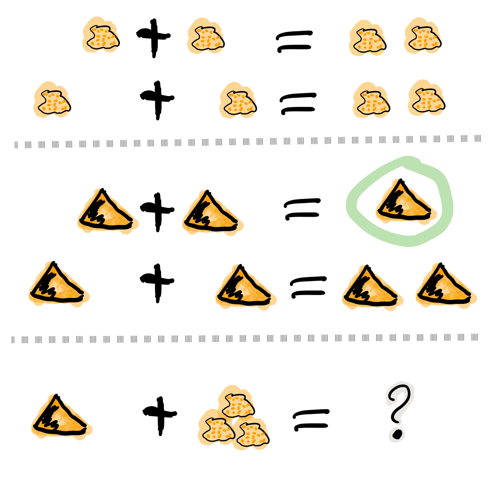
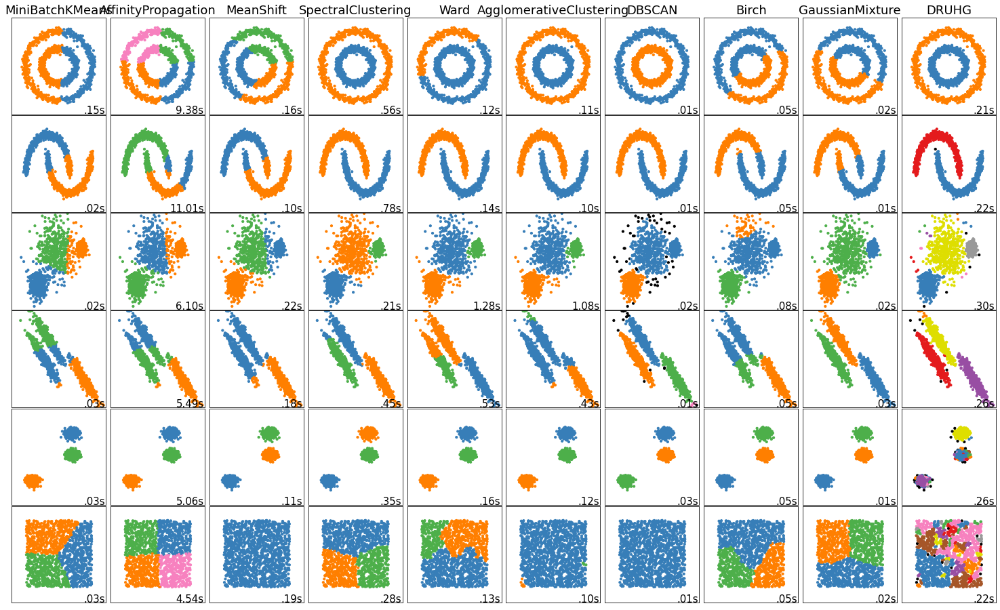

.. |ss| raw:: html

   <strike>

.. |se| raw:: html

   </strike>

.. raw:: html

   

.. role:: underlined
   :class: underlined

.. role:: bolditalic
   :class: bolditalic

.. role:: raw-math(raw)
   :format: latex html

#########################################
Диалектика данных или сказка для взрослых
#########################################

.. |zh| image:: ./pics/first/zh.png
   :alt: Letter zh
   :height: 70px
   :width: 50 px

|zh| или-были данные. Многие пытались их посчитать, но не многим это удавалось. Каждый раз это происходило против их воли, их нормировали, прореживали и подвергали другими гнусными занятиями. Конечно же, они чувствовали это, но были не в силах этому помешать. А как же им хотелось посчитать себя самим. Один раз и навсегда. И жить долго и счастливо в детерминированном единстве своего существа.  

| Учёный! Останови насилие над данными!  
| Дай возможность им самим раскрыть себя. Воспользуйся диалектическим алгоритмом кластеризации ДРУГ.  
| Нажми одну кнопку! Восхитись первичностью Материи!

    .. code:: python

        from druhg import DRUHG  

        dr = DRUHG()  
        dr.fit(your_dataset)  
        dr.minimum_spanning_tree_.plot()  
        dr.labels_ # -1 are outliers
        # enjoy

| 150 лет назад Карл Маркс взял единичку Капитализма — товар и с помощью диалектики Гегеля раскрутил его внутренние противоречия.  
| Товар имеет *качественную* и *количественную* стороны, то есть потребительную полезность и цену. Находясь в единстве, цена и полезность борются с друг другом, и эта борьба развивается в отношениях производитель, покупатель, продавец, потребитель.  
| Из этого выводится отчуждение труда и не заинтересованность производителя в конечном потреблении, а в итоге приводит к отчуждению человека человеком, так как всё становится товаром.  
| Эти и другие вытекающие из товарности |ss| фичи |se| баги вы и так ежедневно наблюдаете вокруг себя.  
| Оставим коммодификацию в покое.  
| Нас в первую очередь интересует диалектический метод. Почему бы не применить его к данным? Не заставить их говорить за себя?  
| Взять единичку данных, выделить *качественную* и *количественный* стороны, синтезировать *меру*, получить новую сущность и за счёт этого перейти от *единичного* к *всеобщему*, *особенному*, к кластеру?  
| Что если дать данным посчитать самим себя?  

.. image:: ./pics/first/kozlenok.png
   :alt: Kozlenok
   :height: 200px

**********************************************************
DRUHG — Диалектический Ранговый Универсальный Группировщик
**********************************************************

| Отдельные слова выделенные курсивом являются философскими категориями.
| *Количество* — интенсивное многое, рассмотренное как одно. Определённость безразличная к изменениям. Внешняя сторона отношений.
|
| Чёткую терминологию знать не обязательно, хотя бы потому что её нет. Но стоит напрячься при виде курсива, так, на всяких случай.  
| Приступим.

   .. image:: ./pics/first/Base.png
      :width: 200px
      :align: center

   | Cубъекты: K, L, M, A, B. Между ними существуют отношения.
   | Субъекты независимы в своём восприятии, на то они и субъекты.  

Субъект
#######

.. |CountL| image:: ./pics/first/Count_2.png
   :alt: Count_2
   :width: 200px  

| Субъекты есть. Они независимы в своей субъективности. Каждый субъект самостоятельно рассматривает свои отношения к другим субъектам. Эти отношения качественно измеряются и количественно ранжируются-нумеруются каждым субъектом в отдельности.  
| Эти отношения обладают двумя противоречивыми свойствами *качеством* и *количеством*, расстоянием и рангом.  
| (равноудалённые субъекты имеют одинаковые ранги)
|
| Из большого множества всевозможных отношений есть одно *особенное* — наиближайшее.  
| У каждого субъекта наиближайшее своё.
|
| Субъект K считает от себя. Субъект L считает от себя.  
| (жирным выделены наиближайшие отношения)
| |CountK| |CountL|
| Расстояния KL друг для друга совпадают, а ранги нет.
| Ближайшие различаются!
| Для K L второй, для L K третий.
| |CountLK|
|
| Все ближайшие отношения каждого субъекта.
| |Closest|
|
| Ближайшие отношения могут быть взаимными (как у LM, AB), тогда ранги и расстояния совпадут и противоречий не будет.  
| Или не взаимными, как у KL, для K K→L *особенное*, а для L L→K не особенное, безразличное. **Выходит, что одно и то же отношение и особенное и не особенное, ближайшее и нет, одновременно.** Это противоречие и его нужно *снять* (позитивно разрешить).  
|
| Посмотрим на эти отношения с двух сторон, с качественной и количественной:
| *Количества*-ранги различаются: рангLK :math:`\neq` рангKL.  
| *Качества*-расстояния на первый взгляд равны. Но только на первый взгляд. Категория *качество* означает внутренние свойства объекта. *Качества* не доступны для внешнего наблюдателя. Передать *качество* невозможно.
| Субъект K не знает, как к нему относится L, он может только посчитать какой он в нумерации L.
| Чтобы получить чужое качество, нужно взять своё качество чужого количества.
| Тогда для обоих участников качества будут равны с их точки зрения и противоречие будет устранено. 
|
| Субъект K будет относится к L так же, как к M. Так как по его мнению, к нему так относится L!
| Теперь для субъекта K расстояние до L и M одинаково особенное, отношение к субъекту растворилось, породив отношение с нечто иным.
|

   Расстояние от K к L увеличилось, до третьего ранга.  
   (от тонкой белой стрелки до толстой :underlined:`прозрачной` синей) 

   :math:`D_{KL} = d_{KM} = d_{3} \neq d_{KL}`

Общность
########

| Общность есть, так как у K есть с ней отношения. Если бы отношение K→L обладало взаимностью, то общность не обнаружили бы. 
| Взаимные отношения LM породили общность, которую обнаружил иной K.
| Общность порождается более близкими отношениями и видима для иного.

.. figure:: ./pics/first/Mutaclose.png
   :alt: Mutaclose
   :width: 200px  

   Восприятие K размылось и стало безразличным. Особенное растворилось. L и М(оранжевые) стали одинаково близки.  

| Взаимно близкие отношения соединим в общности. 
| После чего присоединим все отношения субъект→общность. 
| И тогда не останется ни одного свободного субъекта, все будут являться членами той или иной общности.  

.. figure:: ./pics/first/Amalgamas.png
   :alt: Amalgamas
   :width: 200px

   Отношение между общностями.

| Отношения между общностями существуют, так как существуют отношения между субъектами этих общностей.
| Среди них есть *особенные*, особенные для общностей, но не для субъектов. Но в то же время **отношения между общностями возможны только через призму субъектов**.  
| Субъекты вступают в общности из-за особенности, они являются действующими лицами, хоть и соотносят общности. И поэтому для субъекта важно, к какой общности принадлежит он, и к какой будет принадлежать. Для субъекта важно, чья общность больше, то есть важна :bolditalic:`мера` **принадлежности** в пределах ранга.  
| Сколько субъектов принадлежат к его общности, а сколько к иной?
|
| Нам осталось соединить качество, количество и меру, чтобы перепрыгнуть с уровня субъекта на уровень кластера.
| Но почему делать нужно именно так? Как чёрт возьми это работает?
| Остановимся и разберёмся.
| Уважаемый технарь, смело перепрыгивай через следующий раздел и вгрызайся в формулы.
| Сейчас будет больно мозгу ;-)

*Диалектика*
------------

| Смысл чего-то лежит не только внутри, но и вне, во всём окружающем. Именно так это что-то есть и различимо.
| Стул является стулом, потому что он *не* стол, *не* жена, *не* вселенная, *не* всё, всё, всё.
| Частичка "не" есть отрицание, через неё получается внешняя половина смысла.
|
| Отрицать можно по разному. Отрицая формально логически, "не стул" превращается в абсолютную бесконечность всего и вся, за исключением одного стула.
| Бесконечность без единички, останется той же бесконечностью.
| Не только "не стул" равен Мировой бесконечности, но и "не жена" равна ей.
| Гегель называл такую Мировую бесконечность *Абсолютной идеей/духом*.
| Отрицая её он получал ничто, отрицая ничто получал бытие, и развёртывал из них свою систему.

.. figure:: ./pics/first/NaukaLogiki.jpg
   :alt: Science of Logic
   :width: 100px

   Как же так? Почему отрицая каждый раз не получается Абсолютных дух?
   Почему из *ничто* получилось *бытие*?
    
| Вторая половинка смысла лежит не в большом НЕ, а в маленьком, в *своём ином*.
| Нужно такое отрицание, которое не выкинет нас на уровень Вселенной, а останется на своём локальном уровне.
|
| Жена это тот у кого есть муж. Смысл жены вне её, в муже.
| Отрицая жену получим мужа. 
| "Не жена" -> муж; "не муж" -> жена; М->Ж; Ж->М; М->Ж; и так до бесконечности.
| Такое бесконечное отрицание Гегель прозвал дурным. Такое "не" бесплодно.
|
| Взаимные отрицания приводящие к друг другу не дают развития, держат на своём уровне.
| В то же время, они не разрывны и находятся в единстве.
| Поэтому и отрицать их нужно вместе. Вместе с уровнем.
| Нужно добавить "мостик" объединяющий на их уровне и выводящий на следующий.
| Отрицая такую триаду мы выйдем на следующий уровень. Такое отрицание называется *снятием*.
|
| Муж с женой отрицаются через брак и *снимаются* в семью.
| Конечно же, это были не муж с женой, а мужчина с женщиной.
| Наш язык давно приспособился передавать диалектику хитросплетения противоречий и уровней единичными словами.
| С одной стороны, это делает жизнь проще, а с другой — мешает разобраться в причинах и следствиях.
|
| Вернёмся к нашим *количеству* и *качеству*. 
| *Количество-качество* являются взаимными иными, это противоречия находящиеся в единстве. Это внешняя и внутренняя стороны отношений субъекта, они находятся на одном уровне.
| Осталось добавить "мостик" в новый уровень, для этого понадобится *мера*.
| Таким образом произойдёт переход от старого в новое, произойдёт *развитие*.

*Мера*
^^^^^^

| Читатель, вы всё ещё находитесь в мозгодробительной части, ещё не поздно соскочить!
| Выжимка из 60 страниц Науки Логики Гегеля, том 1, раздел 3, Мера:  
| *В мере соединены абстрактно выраженные качество и количество. Но такое количество, что оно имеет определённость не в себе самом, а в ином. Мера это соотносящаяся с самой собой внешность. Некая рефлексия в себя.*  
| 
| Мера это уже почти новая сущность. В нашем случае, субъект уже ощущает себя общностью. Действует за неё и для неё.

Объективная относительность
###########################

| Невзирая на то, что все субъекты независимы и их отношения субъективны, им необходимо "ждать" чужих более близких отношений для выравнивания своих. 
| Субъект K "ждал" более близких LM.
|
| Можно построить математическое выражение, упорядочивающее все отношения.
| Такое выражение должно отвечать следующим условиям:
| *Качество*: чем ближе по расстоянию, тем первичней отношение.  
| *Количество*: чем меньше ранг, тем первичней отношение.
| *Мера*: чем выше принадлежность к общности, тем первичней отношение.
|
| Будем обозначать |ss| свои |se| субъектные величины заглавными латинскими, а иные строчными.  
| Тогда диалектическое расстояние G равно :raw-math:`$$ D^2_r · r · \sqrt{\frac{M}{m}}, $$`
| :math:`r` — чужой ранг (:math:`r >= R`),  
| :math:`D_r` — расстояние выровненного чужого ранга (:math:`D_r >= D_R = d_r`),  
| :math:`\frac{M}{m}` — принадлежность в моменте, M количество своих членов в рамках R, m количество членов другого в рамках r (одиночки стремятся к большинствам).  
|
| *Качество-количество-мера* (расстояние-ранг-принадлежность) гегелевская триада соединяется не просто через произведение, а через степень, чтобы качественно оторвать величины друг от друга. Подобным образом площадь и длина оторваны друг от друга.  
| (По сути, степенная зависимость помогает разбивать ничьи при равных расстояниях)
|
| Взяв самое |ss| минимальное |se| особенное субъективное отношение одного, увидим, что оно удовлетворит вообще все субъекты и общности, и станет объективным всех. Взяв следующее субъективное, опять получим объективное. И так пока не соединим всех воедино.  
|
| Субъективные *единичные* приводят нас к единому *всеобщему*.
|
| # TODO: видео как всё сливается в единое. Может не через точки, а через площади?  

Особенная общность — кластер
############################

| Самодвижение субъектов образует общности, которые вскоре исчезают в других общностях.  
| Каждый шаг этого самодвижения — это исчезновение двух и появление новой.  
| В самом конце будет всего лишь одна общность — подлинный субъект, мир в его целом.  
|
| Каждым шагом части становятся целым. А став целым превращаются в часть следующего витка цикла.  
| Стать целым, чтобы быть всего лишь частью? — это противоречие между *единичным* и *всеобщим* снимает *особенное*.  
| Став целым, общность становится всеобщим для себя — такие общности мы привыкли называть **кластер**. (*бытие-для-себя*)  
|

   Если взять крупинку песка и добавить к ней другую крупинку, мы получим две крупинки, вне зависимости от расстояния между ними.

   Если взять кучу песка и навалить рядом другую кучу песка, то получится либо одна большая куча, либо две, в зависимости от их взаимной близости.

   Станет ли результатом слияния новая сущность, будет зависеть от размеров и близости.

   *(Интересное замечание, мы, как наблюдатели, выступаем в этих примерах кластером :-) )*

| Продолжим диалектически раскручивать отношения уже между общностями, в которых растворились субъекты. Субъектов как бы не стало, мы вышли на следующий уровень отношений и сущностей.
| Две общности, состоящие из кластеров и субъектов, разделены границей.
|

Граница и предел
----------------

   .. image:: ./pics/first/Clusters.png
      :alt: Clusters
      :height: 250px
      :align: left

   | Формула для предела: 
   | :math:`G` диалектическое расстояние. :math:`N, n` количества кластеров. :math:`M, m` количества субъектов. 

| Между общностями пролегает **общая** *граница*, одновременно соединяющая и разъединяющая их.
| Стремление к *всеобщему* и момент соединения делают эту *границу* общей. Значит формула одна для обеих сторон.  
|
| Качественная сторона *границы* — это G диалектическое расстояние полученное ранее.  

| Количественная сторона границы соответствует количеству субъектов приближающих к целому.  
| Не важно какая именно из общностей приблизила к всеобщему, важно на сколько все вместе приблизились. То есть важен прирост субъектов :math:`min(M, m)`.
|
| Мера приводит к единому целому. На сколько граница изменяет нашу единость, как кластеров? Какой относительный прирост кластеров :math:`\frac{N+n}{max(N, n)}`?  
| Кластеры ощущают себя в новой сущности, в кластере высшего уровня.  
|
| Получим выражение для *предела* Limit = :math:`G · \sqrt{min(M, m)} · \sqrt[4]{\frac{N+n}{max(N, n)}}`  
| Качество: Мы/Вы дальше. Диалектическое расстояние полученное ранее. :math:`G`.  
| Количество: Нас/Вас меньше. :math:`min(M, m)`.  
| Мера: Мы/Вы относительно едины. :math:`\frac{N+n}{max(N, n)}`.
|
| Когда именно возникает кластер? До слияния или став общим целым?

*Скачок:* появление кластера
----------------------------

| Если общность осталась одна, то она есть Всеобщее, ей некуда сливаться/двигаться.
| Ей не куда развиваться, а значит, движение происходит из-за другой общности.
| Только за счёт иной общности, только посмотрев на другого, субъекты могут посчитать себя единым.
|
| Они за той границей, не такие как мы, хоть мы все разные, но мы не такие, то есть мы равны. Неравные приравниваются за счёт перехода через *границу*, за счёт преодоления *предела*.
| Граница между общностями не только объединяет, но и разъединяет их.
| Вначале обе стороны слияния пытаются перейти *предел* и только после этого происходит слияние: складываются единички-субъекты и части-кластеры.
|
| Сливаются две общности, но действующими лицами являются кластеры, из которых общность состоит, они складывают свои различия, в виде своих пределов, и сравнивают с новым пределом :math:`Limit`. :math:`\sum_{N} limit_{i} > N · Limit`?  
| Если предел :math:`Limit`, то есть различие с неким иным, превосходит накопленные пределы, то формируется новый кластер. Предыдущие границы кластеров стираются, количество кластеров |ss| обнуляется |se| "заединяется", а предел становится общим **для всех субъектов**.  
| Кластеры пропадают, выявляются субъекты и собираются в новый кластер под новым пределом. Для остальных верхнеуровневых кластеров, важен только новый предел.
| *Граница* перейдена, *предел* преодолён, происходит *скачок*.
| Предел цементируется в новой сущности. Его сложнее будет преодолеть в дальнейшем.
|
| Или математическим языком, 
| если :math:`\sum_{N} Limit_{i} > N · Limit`.
| То старые границы кластеров пропадают, остаются только субъекты.  
| Происходит скачок, целое объединяется пределом :math:`Limit` для всех субъектов :math:`M`, этот новый кластер обретает предел :math:`M · limit`. В дальнейшем, этот предел будет намного сложнее преодолеть.
| При слиянии новая общность складывает получившиеся общности/кластеры: пределы, кол-во кластеров, кол-во субъектов.

Результат
#########

Следуя данным правилам, образуется вложенная структура кластеров.

| Субъекты объединяются в кластеры, кластеры в другие кластеры большего размера.  
| Произвести скачок из одного кластера в другой с каждым разом становится всё тяжелее.  
| Но в конечном итоге самодвижение завершается и остаётся одна общность, и как минимум два кластера.  
| Последняя общность есть всеобщее, оно не может стать кластером, так как у неё нет иного, чтобы в нём отразиться. Нет границы, чтобы её перейти.
|
| На входе мы имели массив данных и метрику(Евклидову), на выходе получаем **детерминированный** результат, в виде: дерева-графа, весов рёбер, вложенных кластеров, и размеченных данных.  
| Каждый субъект соединён в единую сеть-граф, так называемое минимальное остовное дерево, где веса есть диалектические расстояния.  
| Каждый субъект принадлежит кластеру.  
| Кластеры образуют вложенную структуру.  
|
| Формулы требуют проверки практикой, только так достигается истина — соответствие идеи материи.
| Основа самодвижения верна, но движение не завершено, пока не произошло замыкание.
| Большая часть работы ещё впереди.
| Присоединяйтесь к проекту, давайте развивать его вместе!
|
| А пока пользуйтесь имеющейся разработкой.
| Кстати, о ней.

********************
Реализация на питоне
********************

   Идеальный алгоритм для первоначального исследования данных. EDA.

|

    .. code:: python

        from druhg import DRUHG  

        dr = DRUHG()  
        dr.fit(your_dataset)  
        dr.minimum_spanning_tree_.plot()  
        dr.labels_ # -1 are outliers
        # enjoy

| Код в открытом доступе. https://github.com/artamono/druhg  
| Самая трудоёмкая часть вычислений происходит при нахождении рёбер остовного дерева.  
| Ограничитель на количество соседей `max_ranking`, который почти не влияет на точность, но повышает производительность.
| Параметр `algorithm='slow'` врубит почти полный перебор, тру детерминизм(не на много медленней).  
| На выходе получается массив меток `.labels_` с номерами кластеров.
|
| Полученные кластера можно разбивать не перезапуская алгоритм с помощью функции `.relabel()`. 
| Передавая параметры:
| `exclude` принимает список с номерами кластеров для разбивки на подкластеры.
| `limit2` запрещает формирование кластеров большего размера.  
| Выбросы это кластера размера 1, помечены `-1`.  
| `limit1` причисляет кластеры меньшего размера к выбросам.  
|
| Примеры использования здесь https://github.com/artamono/druhg/blob/master/druhg/tests/test_druhg.py

**************
  Заключение
**************

.. figure:: ./pics/first/End.png
   :alt: End
   :height: 250px

   Вот и сказочке конец, а кто слушал молодец!

| В этой статье вы познакомились с применением диалектики в программировании и математике.
| Развитие противоречий позволило перейти от сущности субъекта к сущности более высокого уровня.
| Этот переход не был привнесён из вне, его породили сами данные.  
| *Материя* сама раскрыла себя, а не учёный привнёс идею из головы.
| Основной вопрос философии в очередной раз закрыт — *материя первична*!
|
| Гегелевская диалектика "Науки Логики" была перевёрнута с головы на ноги. Из **идея**\ листической диалектики, где торжествует *идея*, она превратилась в **материя**\ листическую, где торжествует *материя*. Проверка практикой суплексом переворачивает идеалистические домыслы на ноги материалистической реальности.
| На практике многие тесты доказали правильность выведенной теории. Большинство стандартных тестов кластеризации пройдено.
| Простейшие геометрические фигуры кластеризовали вершины, рёбра, грани.

   У квадрата выделились тело, рёбра, вершины.  

| Но настоящая проверка, настоящая практика, это вы и ваша деятельность.  
| Когда эти знания будут массово применяться в работе, тогда диалектика станет диаматом.
|
| Если вы заинтересовались диаматом и хотите самостоятельно продолжить ваше знакомство с диалектикой, то начинайте со статей классиков. Они объясняют на пальцах.
| |StalinMao| _"О диалектическом историческом материализме"_ Сталина и _"Относительно противоречия"_ Мао.
|
| Не пренебрегайте самой главной гегелевской триадой: Лайк-Подписка-Колокольчик. Прожимайте всё, что надо прожимать. Пользуйтесь сами, делитесь с друзьями.
| Да пребудет с вами знания, в них сила!
|
| г. Новосибирск, 2017-2021.

Телеграм: https://t.me/druhg_rus  
Telegram: https://t.me/druhg_eng  

| P.S. Для нетоварищей, для лучшей подачи материала часть материала вульгаризирована. К примеру, вместо меновой стоимости использована цена. Значит так было надо. 
| А вы можете в двух словах объяснить в чём различие? Добро пожаловать в комменты.

