# Диалектика данных или сказка для взрослых

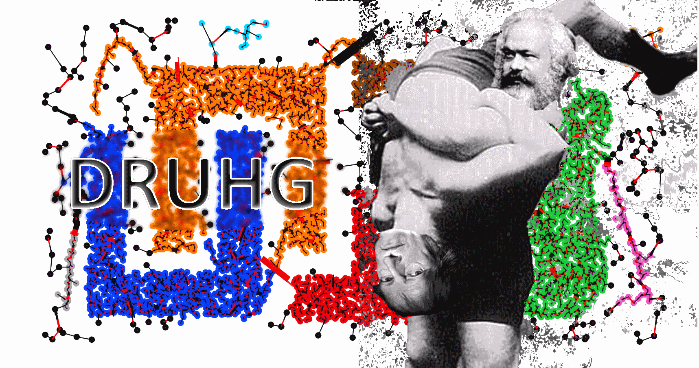  

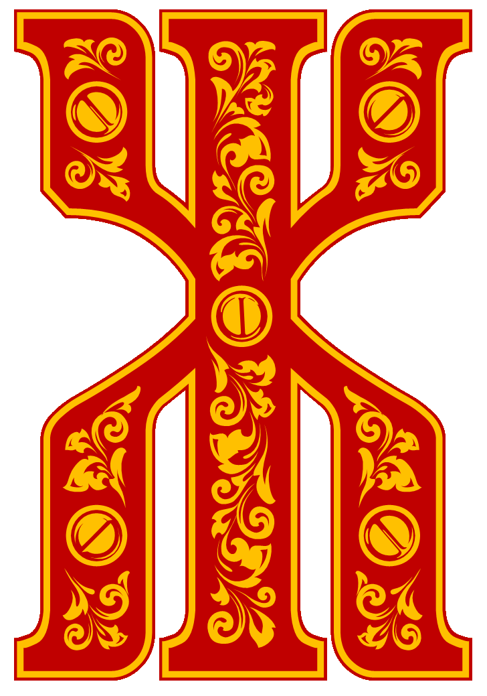или-были данные. Многие пытались их посчитать, но не многим это удавалось. Каждый раз это происходило против их воли, их нормировали, прорежали и занимались другими гнусными делами. Конечно же, они чувствовали это, но были не в силах этому помешать. А как же им хотелось посчитать себя самим. Один раз и навсегда. И жить долго и счастливо в детерминированном единстве своего существа.  

Учёный! Останови насилие над данными!  
Дай возможность им самим раскрыть себя. Воспользуйся диалектическим алгоритмом кластеризации ДРУГ.  
Нажми одну кнопку! Восхитись первичностью Материи!

    # python  
    from druhg import DRUHG  
    
    dr = DRUHG()  
    dr.fit(your_dataset)  
    dr.minimum_spanning_tree_.plot()  
    # enjoy

150 лет назад Карл Маркс взял единичку Капитализма - товар и с помощью диалектики Гегеля раскрутил его внутренние противоречия.  
Товар имеет *качественную* и *количественную* стороны, то есть потребительскую полезность и цену. Находясь в единстве цена и полезность борются с друг другом, и эта борьба развивается в отношениях производитель, покупатель, продавец, потребитель.  
Из чего выводится отчуждение труда и не заинтересованность производителя в потреблении, а в конечном итоге приводит к отчуждению человека человеком.  
Эти и другие вытекающие из товарности ~~фичи~~ баги вы и так ежедневно наблюдаете вокруг себя.  
Не будем об этом.  
Нас в первую очередь интересуют диалектический метод. Почему не применить его к данным? Не заставить их говорить за себя?  
Взять единичку данных, выделить *качественную* и *количественный* стороны, синтезировать *меру*, получить новую сущность и за счёт этого перейти к *единичному*, *всеобщему* и *особенному*, к кластеру?  
Что если дать данным посчитать самим себя?  

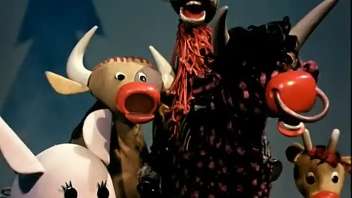  

# Диалектический Ранговый Универсальный Группировщик (DRUHG)

Отдельные слова выделенные курсивом являются философскими категориями.  
Пример, *количество* - интенсивное многое рассмотренное, как одно. Определённость безразличная к изменениям.  

Чёткую терминологию знать не обязательно, хотя бы потому что её нет. Но стоит напрячься при виде курсива, так на всяких случай.  
Приступим.

> На рисунке изображены субъекты K, L, M, A, B  
> Между ними существуют отношения.  
> Субъекты независимы в своём восприятии, на то они и субъекты.  
> 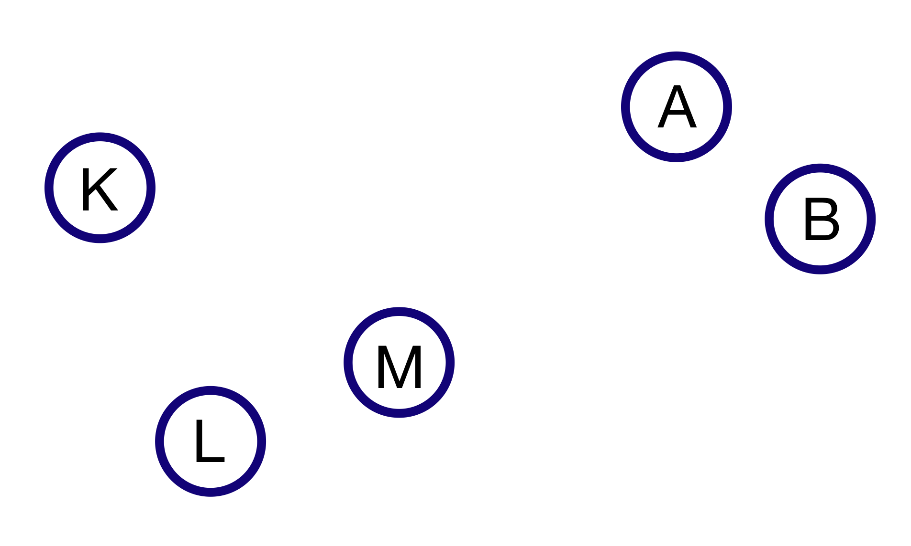  

## Субъект

Субъекты есть. Они независимы в своей субъективности. Каждый субъект самостоятельно рассматривает свои отношения к другим субъектам. Свои отношения к другим субъектам он может с одной стороны измерить для себя, и с другой проранжировать-пронумеровать.  
То есть отношения субъекта к другим обладают двумя противоречивыми свойствами *качеством* и *количеством*, расстоянием и рангом.  
(субъекты могут быть одинаковых рангов)

> _На рисунках субъект K считает от себя. Субъект L считает от себя.  
> (жирным выделены наиближайшие отношения)  
> 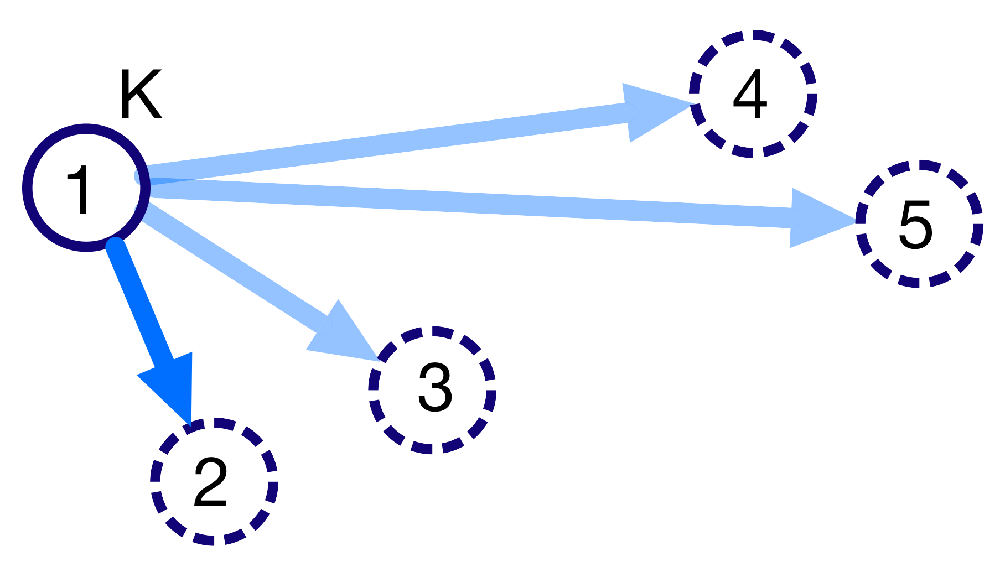   
> Их взаимные ранги не совпадают, хотя расстояние то же.  
> Ближайшие различаются!_  
> 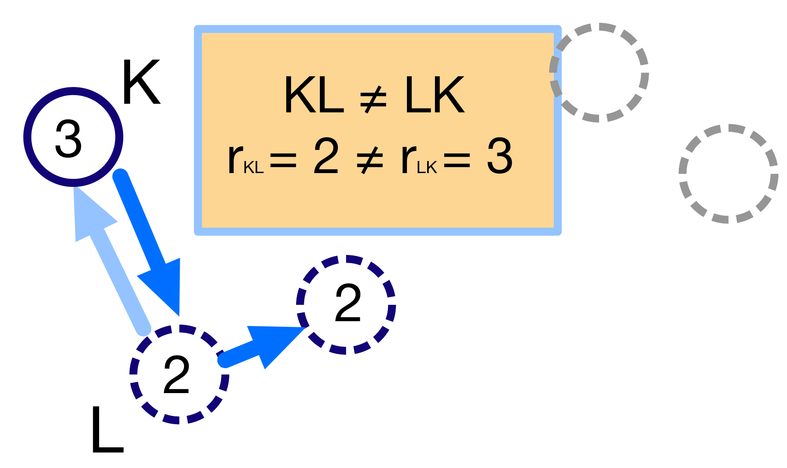

Из большого множества всевозможных отношений есть одно *особенное* - наиближайшее.  
У каждого субъекта наиближайшее своё.

> _Стрелками изображены ближайшие соседи каждого субъекта._  
>   

Эти отношения могут быть взаимными (как у LM, AB), ранги и расстояния совпадут и тогда противоречий не будет.  
Или не взаимными различными, например для K→L, для K оно *особенное*, а для L отношение L→K не особенное, безразличное. **Выходит, что одно и то же отношение и особенное и не особенное, ближайшее и нет, одновременно.** Это противоречие нужно *снять*(позитивно разрешить).  
*Количества*-ранги различаются рангLK $\neq$ рангKL.  
А вот *качества*-расстояния на первый взгляд равны. Но только на первый взгляд. Категория *качество* означает внутренние свойства объекта. *Качества* не доступны для внешнего наблюдателя. Передать *качество* невозможно.  
Поэтому для устранения противоречия нужно взять своё качество чужого количества.

То есть субъект K будет относится к L, также как к M. Тогда ранги совпадут и расстояния тоже совпадут.  
Теперь для субъекта K расстояние до L и M одинаково особенное, отношение к субъекту растворилось, породив отношение с нечто иным.

> Расстояние от K к L увеличилось, до третьего ранга.  
> (от тонкой белой стрелки до толстой синей)  
> $D_{KL} = d_{KM} = d_{3} \neq d_{KL}$  
> 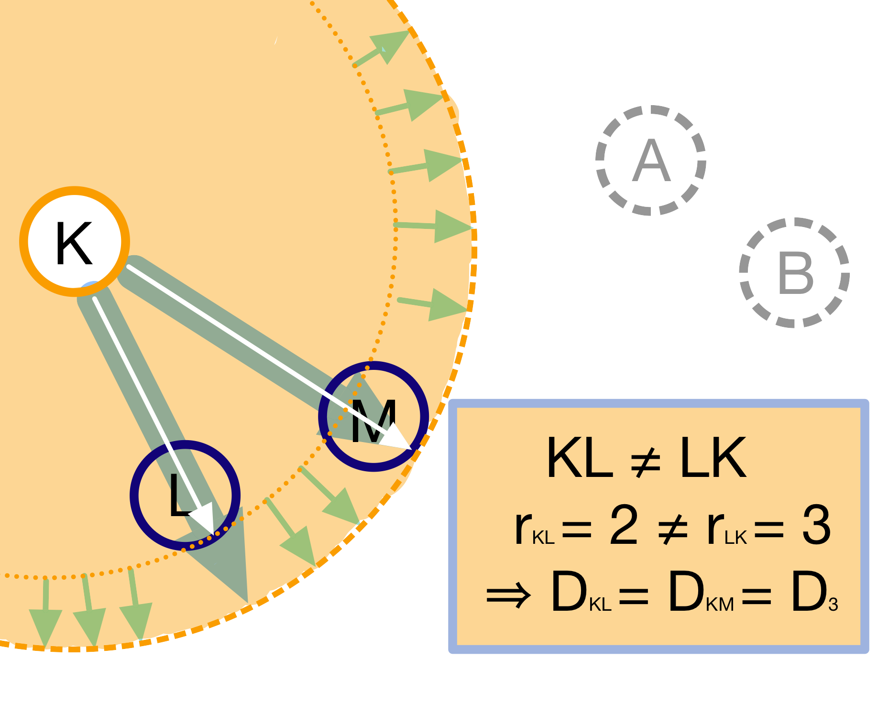  

## Общность

Общность есть, так как у K есть с ней отношения. Если бы отношение K→L обладало взаимностью, то общность была бы не обнаружена. То есть общность порождается более близкими отношениями и видима для иного.  
Действительно, взаимные отношения породили общность, которую обнаружили иные.
_(бытие для-иного)_

> Из-за изменения восприятия K, особенное к субъекту размылось и стало безразличным. L и М одинаково близки.  
> 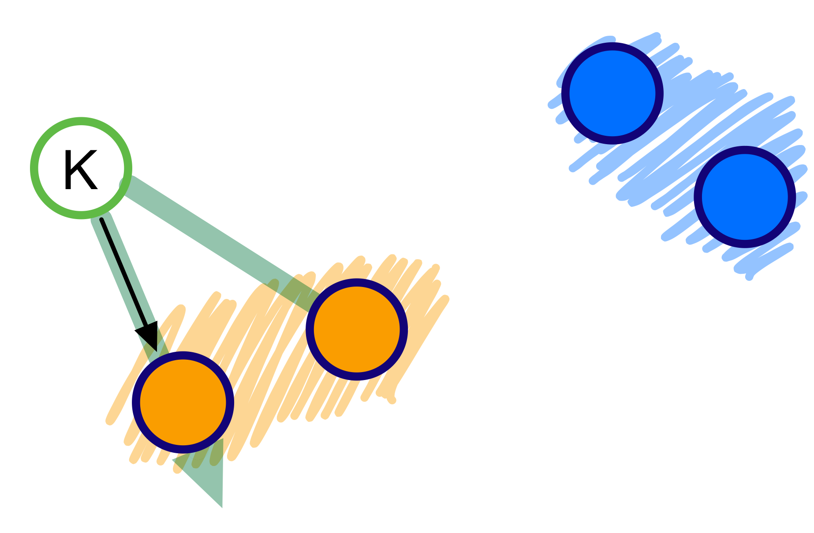  

Для восстановления всей картины всех отношений, нам нужно начинать с самых особенных среди всех, взаимно близких. После чего мы можем присоединить все отношения субъект→общность, и тогда не останется ни одного свободного субъекта, все будут являться членами той или иной общности.  

> Отношения между общностями существуют, так как существуют отношения между субъектами этих общностей. Далее мы покажем, почему субъект считает себя частью общности.  
> 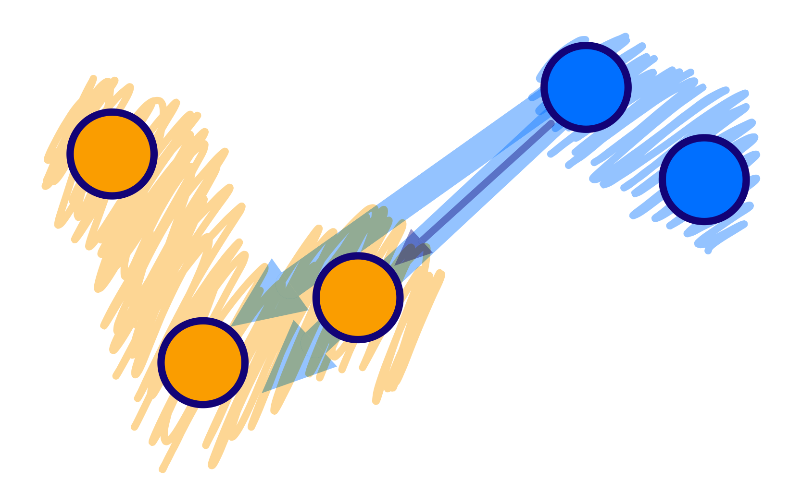  

Разнообразие начальных отношений никуда не делось. Среди всех субъектных отношений, есть отношения между разными общностями. Среди них есть *особенные*, особенные для общностей, но не для субъектов. Но в то же время отношения **между общностями возможны только через призму субъектов**.  
Субъекты вступают в общности из-за особенности, они являются действующими лицами, хоть и соотносят общности. И поэтому для субъекта важно к какой общности принадлежит он, и к какой будет принадлежать. Для субъекта важно чья общность больше, то есть важна ***мера* принадлежности** в пределах ранга.  
Сколько субъектов принадлежат к его общности, а сколько к иной?  

### _Мера_

По Гегелю:  
_В мере соединены абстрактно выраженные качество и количество. Но такое количество, что оно имеет определённость не в себе самом, а в ином. Мера это соотносящаяся с самой собой внешность. Некая рефлексия в себя._  
Мера это уже почти новая сущность. В нашем случае, субъект уже ощущает себя общностью. Действует за неё и для неё.  

## Объективная относительность

Не взирая на то, что все субъекты независимы и на субъективность их отношений, им необходимо "ждать" чужих более близких отношений для выравнивания своих. Субъект K "ждал" более близких LM.  
Можно построить математическое выражение упорядочивающее все отношения.  
Такое выражение должно отвечать следующим условиям:  
Качество: чем ближе по расстоянию, тем первичней отношение.  
Количество: чем меньше ранг, тем первичней отношение.  
Мера: чем выше принадлежность к общности, тем первичней отношение.

Будем обозначать ~~свои~~ субъектные величины заглавными латинскими, а иные строчными.  
Тогда диалектическое расстояние G равно, *$D^2_r · r · \sqrt{\frac{M}{m}}$*, где  
где $r$ - чужой ранг ($r >= R$),  
где $D_r$ - расстояние выровненного чужого ранга ($D_r >= D_R = d_r$),  
$\frac{M}{m}$ - принадлежность в моменте, M количество своих членов в рамках R, m количество членов другого в рамках r (одиночки стремятся к большинствам).  

*Качество-количество-мера* (расстояние-ранг-принадлежность) гегелевская триада соединяется не просто через произведение, а через степень, чтобы качественно оторвать величины друг от друга. Подобным образом площадь и длина оторваны друг от друга.  
(По сути, степенная зависимость помогает разбивать ничьи при равных расстояниях)

Взяв самое ~~минимальное~~ особенное субъективное отношение одного оказывается, что оно удовлетворит вообще все субъекты и общности, и станет объективным всех. Взяв следующее субъективное, опять получим объективное. И так пока не соединим всех воедино.  

Субъективные *единичные* приводят нас к единому *всеобщему*.

-# TODO: видео как всё сливается в единое. Может не через точки, а через площади?  

## Особенная общность - кластер

Самодвижение субъектов образует общности, которые вскоре исчезают в других общностях.  
Каждый шаг этого самодвижения это исчезновение двух и появление новой.  
В самом конце будет всего лишь одна общность - подлинный субъект, мир в его целом.  

Каждым шагом части становятся целым. А став целым превращаются в часть следующего витка цикла.  
Стать целым, чтобы быть всего лишь частью? - это противоречие между *единичным* и *всеобщим* снимает *особенное*.  
Став целым общность становится всеобщим для себя - такие общности мы привыкли называть **кластер**. (_бытие-для-себя_)  
*Общность и кластер у Гегеля это экстенсивное и интенсивное количества. К сожалению он не выводит их через строгую систему. Или к счастью.*  

> Результат слияния зависит не только от близости, но и от размера-количества.  
> Не важно на каком расстоянии две крупинки, в сумме будут две крупинки.  
> Для двух куч песка, важно на сколько близко их высыпать.  
> Как рассчитать результат прибавления крупинок к куче?  
> 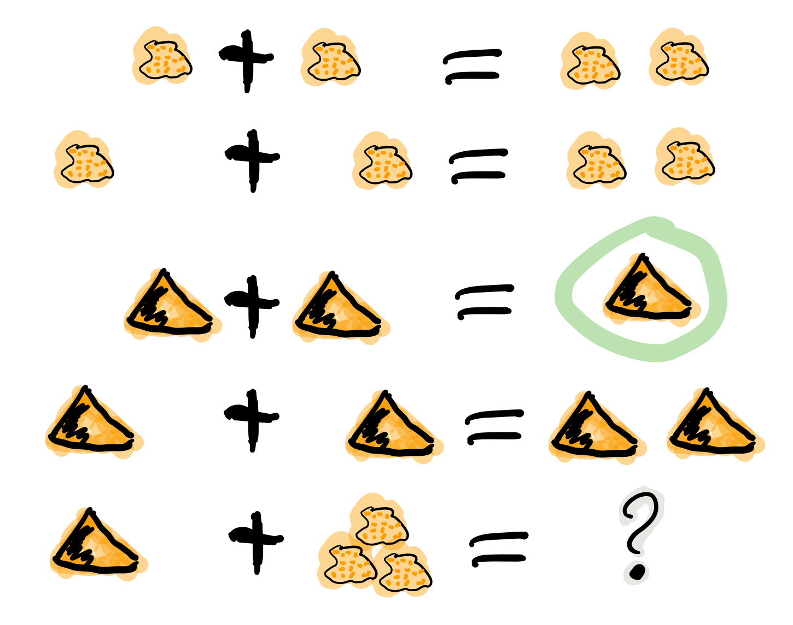  

Если общность осталась одна, то она есть Всеобщее, ей некуда сливаться/двигаться.
А значит движение происходит из-за другой общности.  

Если взять крупинку песка и добавить к ней другую крупинку, мы получим две крупинки, вне зависимости от расстояния между ними.
Если взять кучу песка и навалить рядом другую кучу песка, то получится либо одна большая куча, либо две, в зависимости от их взаимной близости.  
Станет ли результатом слияния новая сущность, будет зависеть от размеров и близости.  
_(Интересный момент, мы, как наблюдатели, выступаем в этих примерах кластером :-) )_

Продолжим диалектически раскручивать отношения уже между общностями в которых растворились субъекты. Субъектов, как бы не стало, мы вышли на следующий уровень отношений и сущностей.  

> Две общности, состоящие из кластеров и субъектов, разделены границей.  
> Формула для предела.  
> $G$ диалектическое расстояние. $N, n$ количества кластеров. $M, m$ количества субъектов.  
> 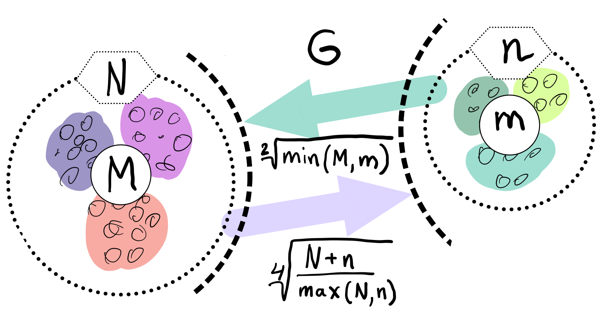  

Между общностями пролегает **общая** *граница*, одновременно соединяющая и разъединяющая их.
Стремление к *всеобщему* и момент соединения делают эту *границу* общей.  

Качественная сторона *границы* это G диалектическое расстояние полученное ранее.  

Количественная сторона границы соответствует количеству субъектов приближающих к целому.  
Важно, что целое является всеобщим, не важно какая именно из общностей приблизила, важно на сколько все вместе приблизились. То есть важен прирост субъектов $min(M, m)$.  

Мера приводит к единому целому. На сколько граница изменяет нашу единость, как кластеров? Какой относительный прирост кластеров $\frac{N+n}{max(N, n)}$?  
Кластеры ощущают себя в новой сущности, в кластере высшего уровня.  

Получим выражение для *предела* Limit = $G · \sqrt{min(M, m)} · \sqrt[4]{\frac{N+n}{max(N, n)}}$  
Качество: Мы/Вы дальше. Диалектическое расстояние полученное ранее. $G$.  
Количество: Нас/Вас меньше. $min(M, m)$.  
Мера: Мы/Вы относительно едины. $\frac{N+n}{max(N, n)}$.

## Слияние общностей и разъединение кластером

До слияния общности происходит проверка на формирование кластера.  
Вначале обе стороны слияния пытаются перейти *предел* и только после этого происходит слияние при котором складывают единички-субъекты и части-кластеры. (Интенсивные и экстенсивные количества)

Граница между общностями не только объединяет, но и разъединяет их.  
Только за счёт иной общности, только посмотрев на другого, субъекты могут посчитать себя единым.  
Они за той границей, не такие как мы, хоть мы все разные, но мы не такие, то есть мы равны. Неравные приравниваются за счёт перехода через *границу*, за счёт преодоления *предела*.  
Теперь, для остальных верхнеуровневых кластеров, важен только новый предел.

Сливаются две общности, и каждая из общностей пытается преодолеть предел индивидуально.  
Но действующими лицами являются кластеры из которых общность состоит, они складывают свои различия, в виде своих пределов, и сравнивают с новым пределом Limit. $\sum_{N} limit_{i} > N · Limit$?  
Если предел Limit, то есть различие с неким иным, превосходит накопленные пределы, то формируется новый кластер. Предыдущие границы кластеров стираются, количество кластеров ~~обнуляется~~ "заединяется", а предел становится общим **для всех субъектов**.  
Кластеры пропадают, выявляются субъекты и собираются в новый кластер под новым пределом.  
*Граница* перейдена, *предел* преодолён, происходит *скачок*.
Предел цементируется в новой сущности. Его сложнее будет преодолеть дальнейшем.

Или математическим языком, если $\sum_{N} Limit_{i} > N · Limit$.  
Старые границы кластеров пропадают, остаются только субъекты.  
Происходит скачок, целое объединено пределом $Limit$ для всех субъектов $M$, этот кластер обретает предел $M · limit$.  
При слиянии новая общность складывает получившиеся общности/кластеры: пределы, кол-во кластеров, кол-во субъектов.

> Образуется вложенная структура кластеров.  
> Субъекты могут принадлежать разноуровневым кластерам.  
> 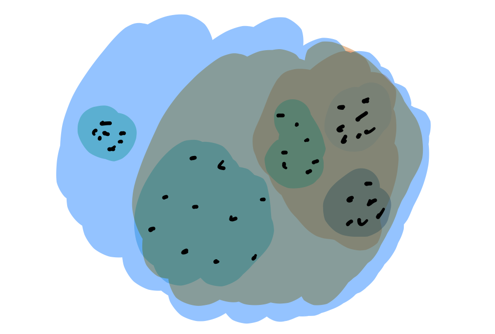    

Субъекты объединяются в кластеры, кластеры в другие кластеры большего размера.  
Произвести скачок из одного кластера в другой с каждым разом становится всё тяжелее.  
Но в конечном итоге самодвижение завершается и остаётся одна общность, и как минимум два кластера.  
Последняя общность есть всеобщее, оно не может стать кластером, так как у неё нет иного, чтобы в нём отразиться. Нет границы, чтобы её перейти.

Все субъекты размечены разноуровневыми кластерами.

## Результат

На входе мы имели массив данных и метрику(Евклидову), на выходе получаем **детерминированный** результат, в виде: дерева-графа, весов рёбер, вложенных кластеров, и размеченных данных.  
Каждый субъект соединён в единую сеть-граф, так называемое минимальное остовное дерево, где веса есть диалектические расстояния.  
Каждый субъект принадлежит кластеру.  
Кластеры образуют вложенную структуру.  

Формулы полученные в этой работе требуют проверки практикой. Возможно какая-то часть будет заменена.  
Любознательный читатель знакомый с диалектикой, понимает, что самодвижение не закончено, пока не произошло замыкание. (Добро пожаловать в комментарии)  
Как ни странно это звучит, но основная часть работы ещё впереди, а пока пользуйтесь на здоровье, и давайте развивать вместе имеющийся питоновский проект.  
Кстати, о нём.

### Реализация на питоне

Код находится в открытом доступе. https://github.com/artamono/druhg  
Самая большая часть вычислений происходит при нахождении рёбер остовного дерева.  
Существует ограничитель на количество соседей `max_ranking`, который почти не влияет на точность.  
Параметр `algorithm='slow'` врубит почти полный перебор, тру детерминизм(не на много медленней).  
Можно переиспользовать остовное дерево с помощью функции `.relabel()`.

На выходе получается массив меток `.labels_`, с номерами кластеров.  
С помощью параметра `exclude` можно передать список с номерами кластеров для
того, чтобы смотреть что внутри.
С помощью параметра `limit2` можно запретить формирование кластеров большего размера.  
Выбросы это кластера размера 1, помечены `-1`.  
С помощью параметра `limit1` можно причислить кластеры меньшего размера к выбросам.  

Примеры использования здесь https://github.com/artamono/druhg/blob/master/druhg/tests/test_druhg.py

# Заключение

> Вот и сказочке конец, а кто слушал молодец!  
>   

В этой статье вы познакомились с применением диалектики в программировании и математике.  
Развитие внутренних противоречий позволило перейти от сущности субъекта к сущности более высокого уровня.  
Этот переход не был привнесён из вне, его породили сами данные.  
То есть не учёный привнёс идею из головы, а *материя* сама раскрыла себя.  
Основной вопрос философии в очередной раз закрыт - *материя первична*!  

Гегелевская диалектика "Науки Логики" была перевёрнута с головы на ноги. Из **идея**листической диалектики, где торжествует *идея*, превратилась в **материя**листическую где торжествует *материя*. Проверка практикой суплексом переворачивает идеалистические домыслы на ноги материалистической реальности.  
На практике многие тесты доказали правильность выведенной теории. Простейшие геометрические фигуры кластеризовали вершины, рёбра, грани. Большинство стандартных тестов кластеризации пройдено.  
Но настоящая проверка, настоящая практика, это вы и ваша деятельность.  
Когда эти знания будут массово применяться в работе, тогда диалектика станет диаматом.

Если вы заинтересовались диаматом и хотите самостоятельно продолжить ваше знакомство с диалектикой, то лучше всего начать со статьи Сталина _"О диалектическом историческом материализме"_.  

Не забывайте про главную гегелевскую триаду Лайк-Подписка-Колокольчик, прожимайте всё что надо прожимать. Пользуйтесь сами, делитесь с друзьями.  
Да пребудет с вами знания, в них сила!

г. Новосибирск, 2017-2020.

Телеграм: https://t.me/druhg_rus  
Telegram: https://t.me/druhg_eng  

P.S. Для нетоварищей, для лучшей подачи материала вместо меновой стоимости использована цена. Значит так надо. А вы можете в двух словах объяснить в чём различие? Добро пожаловать в комменты.
